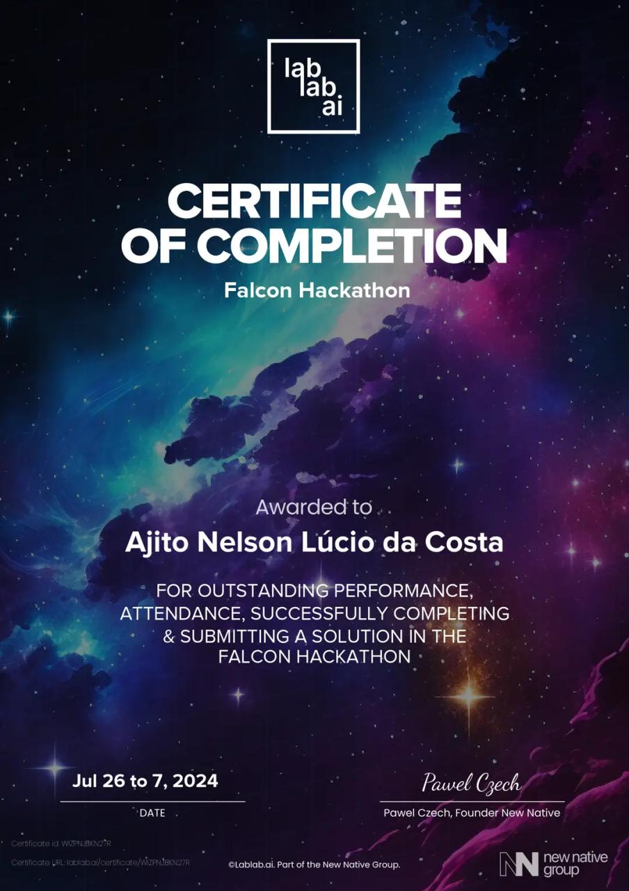

<h1 align="center"><span style="color: crimson">Certificate of completion</span>Falcon Hackathon </h1>

<p align="center">
  
</p>

---

<h1 align="center"><span style="color: crimson">Lkwiz-YT</span>-Lafaek QUIZ YouTube </h1>

<p align="center">
  
</p>

## 1. Welcome to Lkwiz-YT!

Have you ever watched a YouTube video and wondered how much you really understood? With Lkwiz-YT, we offer a unique and engaging way to test and enhance your comprehension of video content.

Lkwiz-YT is an interactive platform designed to help users better understand and retain information from YouTube videos. Our solution combines quizzes and chat functionalities powered by advanced AI technology to create a fun and educational experience.

Our mission is to transform passive video watching into an active learning process, making it easier for everyone, especially non-native English speakers, to grasp complex topics and improve their knowledge retention.

Explore more about our journey and application at: [Lkwiz-YT at the Falcon Hackathon in Lalabai](https://lablab.ai/event/falcon-hackathon/lafaek-ai/lkwiz-yt)

## 2. How Lkwiz-YT Works Using Falcon 180B with AI71 API

Lkwiz-YT enhances YouTube video comprehension through an interactive process that leverages advanced AI technology. Here's how it works:

### YouTube Video Link Submission

- Users provide the URL of the YouTube video they want to understand better.

### Extracting Video ID and Transcript

- The platform extracts the video ID from the URL.
- It retrieves the video's transcript text, ensuring the video has English captions.

### Using Falcon 180B with AI71 API

- The AI71 API, powered by Falcon 180B, processes the transcript to generate quiz questions and answers.
- This powerful AI model understands the context and details within the video, creating relevant and engaging quiz questions.

### Interactive Quizzes

- Users take the quiz to test their comprehension of the video's content.
- The AI generates multiple-choice questions, ensuring a diverse and thorough assessment.

### Chat Functionality

- Users can ask specific questions about the video's content.
- The AI71 API, with Falcon 180B, provides accurate and context-aware answers to enhance understanding.

## 3. Technical Workflow

1. User inputs the YouTube video URL and AI71 API key.
2. Extract the video ID using the `extract_video_id_from_url` function.
3. Retrieve the transcript text using the `get_transcript_text` function.
4. Generate quiz questions with `get_quiz_data` using the transcript and AI71 API.
5. Display the quiz and capture user responses.
6. Allow users to ask questions about the video content with the `ask_question` function.

## 4. Setup Instructions

To get Lkwiz-YT up and running on your local machine, follow these steps:

### Prerequisites

- Python 3.10
- Pip package manager

### Installation

1. Clone the repository:

   ```bash
   git clone https://github.com/ajitonelsonn/Lkwiz-YT.git
   cd Lkwiz-YT
   ```

2. Create and activate a virtual environment (optional but recommended):

   ```bash
   python3 -m venv venv
   source venv/bin/activate # On Windows use venv\Scripts\activate
   ```

3. Install the required packages:
   ```bash
   pip install -r requirements.txt
   ```

### Running the Application

To run Lkwiz-YT, execute the following command:

```bash
streamlit run streamlit_app.py
```

This will start the Streamlit server, and you should see output indicating the local URL where the app is being served, typically `http://localhost:8501`.

## 5. Using Lkwiz-YT

1. **Provide the YouTube URL and AI71 API Key**

   - Paste the YouTube video URL of your recently watched video.
   - Enter your [AI71 API Key](https://lablab.ai/t/ai71-platform-guide).

2. **Watch, Ask, Quiz**
   - You can watch the video again.
   - You can ask questions about the video in the chat panel.
   - You can generate and take the quiz.

## 6. Contributions

If you'd like to contribute to Lkwiz-YT, please fork the repository and create a pull request with your features or fixes.

## Thank You

Thank you for using Lkwiz-YT! We hope you find it helpful in enhancing your video comprehension and learning experience.

**Made from Timor-Leste 🇹🇱 with ❤️**
